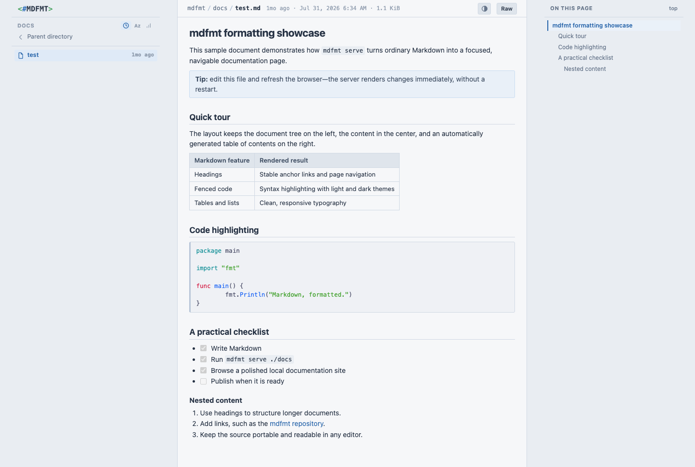
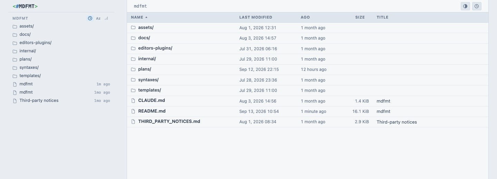

# mdfmt

`mdfmt` turns Markdown into a polished local documentation site or a
self-contained HTML file. It is a single Go binary with embedded templates,
styles, JavaScript, and syntax-highlighting definitions, so it works offline
without adjacent runtime assets.

## Features

* a file explorer for markdown files only
* syntax highlighting of code blocks using Chroma
* better than text editor preview by providing navigation and table of content

## Screenshots

Click either preview to open the full-size image.

<a href="docs/file.png"></a>
<a href="docs/docs.png"></a>

### Commands
#### serve
* great navigation
  * left side: file list
  * center: top breadcrumb and content
  * right side: table of content
* optional: edit button to open the file seen from a graphical text editor
  * then write an editor plugin to call 'mdfmt open' to be able to move between the web browser view and your editor

#### open
* build a URL to a local 'serve' instance and display it in a web browser from any terminal

#### save
* create a standalone html file from any markdown file

## Install

`mdfmt` requires Go 1.26.5 or newer.

```sh
go install github.com/voidexpr/mdfmt@latest
```

To build a checkout:

```sh
make build
./mdfmt --help
```

## Commands

```text
mdfmt serve [OPTIONS] [PATH]
mdfmt open PATH... [OPTIONS]
mdfmt config
mdfmt save [OPTIONS] SOURCE
```

Options may appear before or after the positional path. Run `mdfmt --help`,
`mdfmt serve --help`, `mdfmt open --help`, or `mdfmt save --help` for the
built-in command reference.

### Serve a Markdown tree

```sh
mdfmt serve --bind 127.0.0.1 --port 8642 ./docs
```

`serve` presents an existing directory tree of `.md` and `.markdown` files
(case-insensitively) as a local documentation site. `PATH` defaults to the
current directory. When `--port` is omitted, mdfmt remembers a port for the
resolved root in `~/.mdfmt/ports.json`. The first invocation asks the operating
system to select an available port; later invocations reuse it. Every successful
start records the actual bound port, including starts with an explicit port.

| Option | Default | Behavior |
| --- | --- | --- |
| `--bind IP` | `127.0.0.1` | Bind to the given IP address. Hostnames are not accepted. |
| `--port NUM` | remembered per root | Bind to the given TCP port and remember it for this root. An explicit `0` selects and remembers a random port. |
| `--path-token VALUE` | `auto` | Prefix every served URL with a random, remembered path token. Use `none` to opt out for this launch, or supply a custom token. |
| `--edit-command COMMAND` | disabled | Add Edit controls that directly launch `COMMAND`. |
| `--edit-arg VALUE` | none | Insert an argument before the file path in the editor command. Repeat for multiple arguments. |
| `--edit-sublime` | disabled | Add Edit controls using the Sublime Text `subl` CLI. |
| `--edit-vscode` | disabled | Add Edit controls using the Visual Studio Code `code` CLI. |

The port registry uses canonical, symlink-resolved absolute roots and is
updated atomically while the selected listener remains open. Its format is:

```json
{
  "version": 1,
  "roots": {
    "/absolute/path/to/docs": {
      "port": 49153,
      "path_token": "49caed1e8a8f263d54e824ad62e6b284"
    }
  }
}
```

In `auto` mode, `serve` reuses a remembered non-empty token or generates a new
128-bit token. `--path-token none` records an unprefixed server for `open`, but
the next `serve` using the default `auto` mode returns to a generated token.
Custom tokens may contain 1–128 letters, digits, underscores, or hyphens.
Legacy registry entries without `path_token` are accepted; `serve` upgrades
them, while `open --path-token auto` asks for an explicit override until then.

If a remembered port is occupied, `serve` leaves the association unchanged and
reports how to choose a different explicit port. After that explicit port binds
successfully, it replaces the root's previous association. If an explicit port
is remembered for another root but is currently free, the stale root entry is
removed. An occupied explicit port produces an error and changes nothing.

The resolved root is the server's filesystem boundary. Directory pages and
Markdown documents are generated when requested, so refreshing shows edits
without restarting the server. Non-Markdown files, dotfiles, and
dot-directories are not exposed. Symlinks are followed only when their fully
resolved targets remain beneath the root.

Directory navigation, breadcrumbs, heading IDs, a table of contents, sorting,
responsive light/dark styling, and static assets are self-contained in the
binary. Unsafe raw HTML in Markdown is omitted. Every document page also has a
Raw link that serves the exact source bytes as plain text.

When path tokens are enabled, every document, directory, raw-source, asset, and
editor endpoint requires the prefix. Missing or incorrect tokens return 404.
Generated pages use relative internal URLs and never embed the path token in
their HTML. Root-relative Markdown links such as `/guide.md` are rewritten to
token-free relative links while serving; ordinary relative and external links
are unchanged. Standalone HTML produced by `save` is unaffected.

For quick local edits while browsing:

```sh
mdfmt serve ./docs --edit-sublime
mdfmt serve ./docs --edit-vscode
mdfmt serve ./docs --edit-command /usr/local/bin/my-editor
```

The editor selectors are mutually exclusive. `--edit-arg` requires one of
them and can be repeated. Editor integration is disabled by default and may
only be used with a loopback bind address. The selected executable must resolve
at startup. Accepted edit requests invoke it directly without a shell, after
the requested Markdown path is resolved and checked against the server root.

The server reports its resolved root and address at startup, shuts down
gracefully on SIGINT or SIGTERM, and does not write to the served tree.

### Open served paths

```sh
mdfmt open ./docs/guide.md
mdfmt open ./docs/guide.md "./docs/API notes.md" --print-only
mdfmt open ./guide.md --root ./docs --port 8642 --path-token none
mdfmt open ./docs/guide.md --chrome
```

`open` resolves each file or directory, finds the longest containing root in
`~/.mdfmt/ports.json`, prints its URL to standard output, and launches the
platform browser opener when available. All paths are validated before any
browser is opened. Files must be Markdown files that the server can expose.

| Option | Default | Behavior |
| --- | --- | --- |
| `--port PORT` | remembered for the selected root | Use this port in every generated URL. |
| `--root PATH` | inferred independently for each path | Force every path to be beneath this root. Together with `--port` and an explicit path-token value, the root need not be registered. |
| `--bind ADDRESS` | `127.0.0.1` | Use this IP address as the URL host, for a server started with an unusual bind address. |
| `--path-token VALUE` | `auto` | Read each root's remembered token. Use `none` for an unprefixed URL or supply a custom token. |
| `--chrome` | disabled | On macOS, open each URL with Google Chrome and pass `--focus=URL/*`. |
| `--print-only` | disabled | Print URLs without launching a browser. |

When paths belong to different registered roots, each URL uses the port for its
own longest matching root and, in `auto` mode, that root's remembered path
token. Auto mode fails rather than guessing when a legacy or unregistered root
has no token; use `none` or a custom value explicitly in that case. URL path
components are escaped independently, and directory URLs end in a slash. On
macOS the browser launcher is `open`; on Linux it is `xdg-open`. On macOS, when
Google Chrome is the default browser,
`mdfmt` automatically invokes Chrome with the same focused-tab behavior as
`--chrome`. This is detected directly from the local Launch Services preferences
using macOS's `plutil`; it does not require `jq` or a cache. The flag remains
available to force Chrome when it is not the default. If browser detection fails
or the default platform launcher is unavailable, URL printing still succeeds.

### Inspect remembered ports

```sh
mdfmt config
```

`config` prints remembered roots in port order and shows the process IDs
currently listening on those ports when they can be discovered with the local
`lsof` utility:

```text
Pid   Port   Root
-     7777   /srv/foobar
1234  50432  ~/a/b/c/d
```

Roots beneath the home directory are shortened to `~/…`. A dash means that no
listening process could be identified for that port.

### Save standalone HTML

```sh
mdfmt save ./docs/guide.md
mdfmt save ./docs/guide.md --output ./preview.html
mdfmt save ./docs/guide.md --output ./public --hash --quiet
```

`save` renders one regular source file as a self-contained HTML document with
the same Markdown rendering, heading IDs, table of contents, theme, metadata,
and safe raw-HTML policy as `serve`. The source filename extension is ignored.

| Option | Default | Behavior |
| --- | --- | --- |
| `-o`, `--output TARGET` | system temporary directory | Write to an explicit filename or, when `TARGET` is an existing directory, generate a filename inside it. Parent directories are never created. |
| `--hash` | disabled | Use a stable 24-hex-digit filename derived from the canonical source path. Valid only for generated filenames. |
| `-q`, `--quiet` | disabled | Do not print the absolute output path after a successful save. |

Without `--output`, the result is atomically written beneath
`$TMPDIR/mdfmt/` using the source basename with an `.html` extension. An
existing output directory uses the same generated name. A non-directory
`TARGET`, whether it exists or not, is treated as the exact output filename.
Existing output files are atomically replaced, but the source itself can never
be the target.

The saved file embeds its CSS and JavaScript, contains no source directory
path, starts no server, and needs no adjacent assets.

## Syntax highlighting

Fenced code blocks are highlighted from their language label using Chroma's
built-in language set, plus the project-specific `qeylan` and `qy` labels.
Unknown and unlabeled fences remain escaped plain text. `serve` delivers one
shared light/dark syntax stylesheet; `save` embeds the same stylesheet.

The Qeylan definitions use `.qy` as the primary filename extension and
`qeylan` as the primary Markdown fence label. The `.qeylan` filename extension
and `qy` fence label are also recognized. Matching Sublime Text definitions are
available under `syntaxes/`.

After changing the highlighter or its styles, regenerate and verify the checked
in CSS:

```sh
go generate ./internal/mdhighlight
git diff -- assets/syntax.css
```

## Development

```sh
make test       # unit and integration tests
make test-race  # race detector
make vet        # go vet
make coverage   # coverage report
make ci         # full local CI suite
```

`make ci` additionally runs staticcheck, checks generated syntax CSS and module
tidiness, verifies formatting, and runs `govulncheck`. Run `make install` once
to install the pinned staticcheck and govulncheck versions it uses.

## License

`mdfmt` is available under the permissive [MIT License](LICENSE). Dependency
attributions are listed in [THIRD_PARTY_NOTICES.md](THIRD_PARTY_NOTICES.md).
